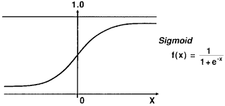

# Loan Prediction Using Logistic Regression

---
## Problem Statement
> The data is about loan applicants & their details required for applying a loan. So the task is to make a ML model to predict the future bank customers/loan applicants' loan approval status.

## Solution

> To start with this task, we want binary-classifier ML algorithm to make a model as the target outcome is (Y) Approved & (N) Not Approved. I have used Binary Logistic Regression here because of multiple reasons,(1) As it satisfies its assumptions like dependent variable should be binary (obviously), little or no multicollinearity among the independent variables.(2) Easier to implement, interpret and very efficient to train. (3) Less prone to overfitting, but can show overfitting in high dimensions - but their are solutions like to use regularization L1 ,L2 to avoid overfitting in this cases.

### Step 1

- **Option 1**
    - 🍴 Fork this repo!

- **Option 2**
    - 👯 Clone this repo to your local machine using `https://github.com/joanaz/HireDot2.git`

### Step 2

- **HACK AWAY!** 🔨🔨🔨

### Step 3

- 🔃 Create a new pull request using <a href="https://github.com/joanaz/HireDot2/compare/" target="_blank">`https://github.com/joanaz/HireDot2/compare/`</a>.

---

## Contact

Reach out to me at one of the following places!

- <a href="https://sites.google.com/view/sonvanebhargav/home" target="_blank">`My Portfolio`</a>
- <a href="https://linkedin.com/in/bhargav-sonvane-15978a185" target="_blank">`My LinkedIN`</a>

---
